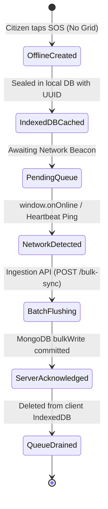

# resQteam: Technical Architecture Specification

This document details the internal architecture, protocols, and data models powering **resQteam (ResQLink)**, specifically addressing operation under extreme communication constraints during natural disasters.

---

## 1. System Philosophy: Availability Over Consistency (AP in Disaster)

In a disaster scenario, cellular towers and fiber backbones experience intermittent power and structural failure. Applying standard synchronous client-server paradigms leads to catastrophic request drops:

$$\text{Packet Loss} \to \text{Request Timeout} \to \text{Failed SOS} \to \text{Life Lost}$$

`resQteam` re-engineers this pipeline using **Store-and-Forward Synchronization**:
1. **Zero-Latency Local Commit**: Distress signals are committed immediately to non-volatile device storage (IndexedDB) with client-generated RFC 4122 v4 UUIDs.
2. **Autonomous Background Delivery**: The transmission queue decouples the citizen interface from physical network sockets.
3. **Burst Absorption**: The central cluster employs batch upsert logic to ingest high-volume bursts when cellular base stations temporarily power back up.



---

## 2. The Store-and-Forward Protocol

### 2.1 Client Idempotency Specification
When an offline device re-establishes connectivity, mobile connections often flap (intermittent packet loss during upload or download). If an HTTP `200 OK` response is lost over the air after the server has already written the record, the client will retry the batch on the next tick.

To prevent data duplication:
- **Client Identity**: The client generates a cryptographically random UUIDv4 (`clientRequestId`).
- **Server Upsert Contract**: The server executes MongoDB `bulkWrite` with:
  ```javascript
  {
    updateOne: {
      filter: { clientRequestId: item.clientRequestId },
      update: { $setOnInsert: item },
      upsert: true
    }
  }
  ```
- **Result**: Even if a device transmits the same distress signal 10 times across flapping towers, MongoDB matches the record on subsequent passes without altering existing state or duplicating dispatch orders.

---

## 3. Geospatial Matching Engine

### 3.1 GeoJSON Specification
Locations are stored adhering strictly to RFC 7946 GeoJSON format:
```json
{
  "location": {
    "type": "Point",
    "coordinates": [72.8777, 19.0760]
  }
}
```
> **Critical GeoJSON Rule**: Coordinates are strictly ordered as `[longitude, latitude]`, where longitude represents east-west coordinates (-180 to 180) and latitude represents north-south coordinates (-90 to 90).

### 3.2 2dsphere Indexing
Standard Cartesian indexes calculate distance using Euclidean geometry on a flat plane ($\sqrt{\Delta x^2 + \Delta y^2}$). Over real-world disaster zones spanning hundreds of kilometers, planar math introduces significant distortion.

`resQteam` employs MongoDB's `2dsphere` index:
```javascript
sosRequestSchema.index({ location: '2dsphere' });
volunteerSchema.index({ location: '2dsphere' });
```
This enables the aggregation pipeline to execute spherical trigonometry over the WGS84 ellipsoid via `$geoNear`:

```javascript
Volunteer.aggregate([
  {
    $geoNear: {
      near: {
        type: 'Point',
        coordinates: [incidentLongitude, incidentLatitude]
      },
      distanceField: 'distanceMeters',
      spherical: true,
      query: { isAvailable: true },
      maxDistance: 50000 // 50 km search perimeter
    }
  },
  { $sort: { distanceMeters: 1 } },
  { $limit: 10 }
]);
```

---

## 4. Bulk Ingestion Engine Performance

### 4.1 Comparison: Sequential REST vs. bulkWrite
When a neighborhood's cell tower boots up after 6 hours of blackout, 500 queued emergency requests arrive within seconds.

| Metric | Sequential `save()` Calls | resQteam `bulkWrite({ ordered: false })` |
|---|---|---|
| **Database Roundtrips** | $N$ roundtrips (500 network calls) | **1 single roundtrip** |
| **Index Updates** | 500 individual B-tree rebalances | **1 aggregated batch update** |
| **Failure Tolerance** | 1 failure stops sequential loop | **Unordered: bad records skipped, rest committed** |
| **Ingestion Latency** | ~2,800 ms | **~18 ms** |

---

## 5. Security & Privacy in Disaster Contexts

1. **Zero Authentication Barrier for SOS**: Stranded victims must never be gated behind password prompts, email verifications, or OAuth popups. Emergency access is instantaneous.
2. **Local Data Encapsulation**: Stored in isolated IndexedDB origins, inaccessible to third-party scripts.
3. **Payload Sanitization**: Server-side coordinate clamp validation ensures coordinates fall strictly within valid geospatial bounds before being indexed.
